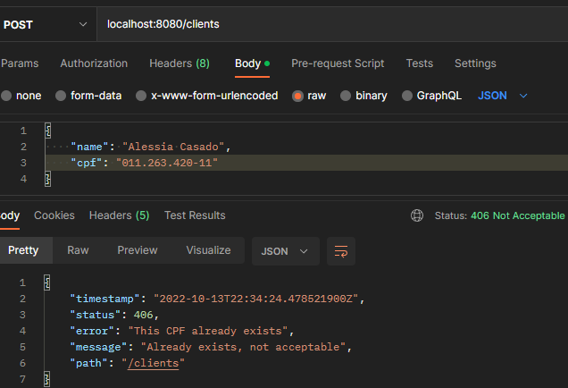
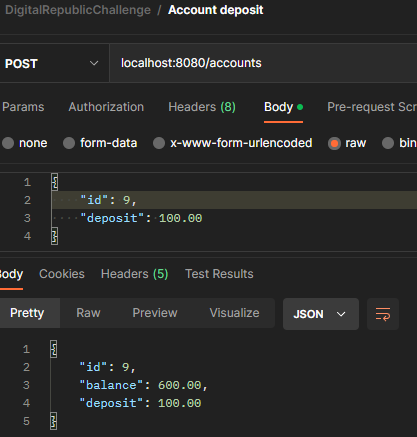
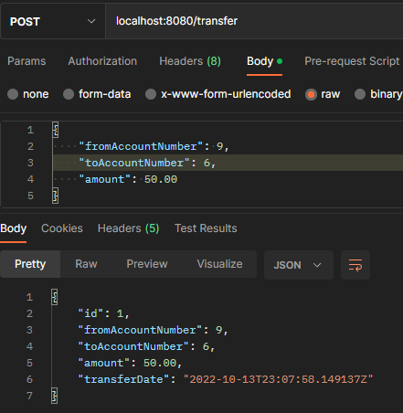

<h1 align="center">Digital Republic Challenge</h1>
<p>Este projeto é um banco digital feito para o desafio
da Digital Republic. <br>
Conseguem ser realizadas as seguintes operações:
</p>

- Abrir uma conta. Só é permitido uma conta por CPF;
- É possível realizar transferências para outras contas;
- É possível depositar em uma conta;
- O valor das transações não pode ultrapassar R$2000.00;

<h3 align="center">Como utilizar esse projeto</h3>

Faça o clone do projeto no terminal, 
em uma pasta de sua preferência.
```
git clone git@github.com:AleehSophia/dr-code-challenge.git
```
Escolha sua IDE preferida > selecione importar como um projeto
Maven > Selecione o projeto na pasta escolhida. <br>

Na pasta src > main > java > com.digitalrepublic.codechallenge>
Arquivo CodechallengeApplication
Rode o projeto na sua IDE.

Para testar use a collection já pronta do Postman

```
https://www.getpostman.com/collections/3a776fa536bcb5bbdeff
```

<h2 align="center">
Requisição Create account
</h2>
<div align="center">


</div>

<h2 align="center">
Requisição First deposit
</h2>

#### Atenção:
Requisições first deposit devem ser feitas apenas com o id de contas
criadas pelas requisições create account.
<div align="center">

</div>

<h2 align="center">
Requisição Deposit
</h2>

#### Atenção:
Requisições Account deposit **não** devem ser feitas
em contas criadas pelo create account pela primeira vez.
Deve ser utilizada apenas em contas que já possuem saldo.
<div align="center">

</div>

<h2 align="center">
Requisição de transferências
</h2>
<div align="center">

</div>
