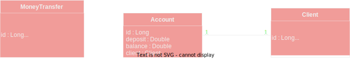

<h1 align="center">Account API</h1>
<div align="center" style="display: inline_block">
    
    
    
</div>

---
<p>Este projeto é uma API REST de um banco digital. <br>
<br>
Conseguem ser realizadas as seguintes operações:
</p>

- Abrir uma conta. Só é permitido uma conta por CPF;
- É possível realizar transferências de uma conta para outra pelo id;
- É possível depositar em uma conta;
- O valor das transações não pode ultrapassar R$2000.00;
- Não é possível ficar com saldo negativo na conta;

---
<h1 align="center">
  Diagrama<br>
  
</h1>

<h1 align="center">Como contribuir?</h1>

- Extrato com todas as transações bancárias referentes a uma conta.
- Melhoria de documentação.
- Implementação de segurança e autenticação.

1. Crie um fork. <br>
2. Crie sua feature branch: `git checkout -b nome`
3. Adcione os arquivos: `git add`
4. Faça um commit: `git commit -m "sua mensagem"`
5. Faça um push na sua branch: `git push origin nome`
6. Envie um pull request para esse repositório

<h1 align="center">Tecnologias utilizadas</h1>

- Java 17
- Spring boot 2.7.4
- H2
- Postgresql

  <h3 align="center">Como utilizar esse projeto</h3>

  Faça o clone do projeto no terminal, 
  em uma pasta de sua preferência.
```
git clone git@github.com:AleehSophia/dr-code-challenge.git
```
  Escolha sua IDE preferida > selecione importar como um projeto
  Maven > Selecione o projeto na pasta escolhida. <br>

  Na pasta src > main > java > com.digitalrepublic.codechallenge>
  Arquivo CodechallengeApplication
  Rode o projeto na sua IDE.

  Para testar use a collection já pronta do Postman

```
https://documenter.getpostman.com/view/17351157/2s8YzUy2fa
```