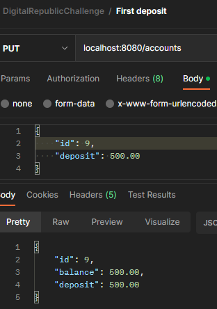
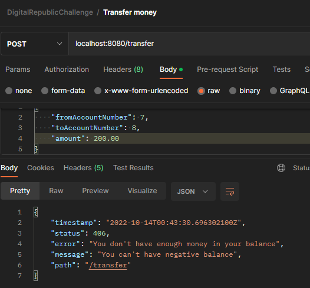

<h1 align="center">Digital Republic Challenge</h1>
<p>Este projeto é um banco digital feito para o desafio
da Digital Republic. <br>
Conseguem ser realizadas as seguintes operações:
</p>

- Abrir uma conta. Só é permitido uma conta por CPF;
- É possível realizar transferências para outras contas;
- É possível depositar em uma conta;
- O valor das transações não pode ultrapassar R$2000.00;
- Não é possível ficar com saldo negativo na conta;

<h3 align="center">Como utilizar esse projeto</h3>

Faça o clone do projeto no terminal, 
em uma pasta de sua preferência.
```
git clone git@github.com:AleehSophia/dr-code-challenge.git
```
Escolha sua IDE preferida > selecione importar como um projeto
Maven > Selecione o projeto na pasta escolhida. <br>

Na pasta src > main > java > com.digitalrepublic.codechallenge>
Arquivo CodechallengeApplication
Rode o projeto na sua IDE.

Para testar use a collection já pronta do Postman

```
https://www.getpostman.com/collections/3a776fa536bcb5bbdeff
```

<h1 align="center">Tecnologias utilizadas</h1>

- Java 18
- Spring boot
- H2
- Postgresql


<h1 align="center">Seed do banco</h1>

````
    create table tb_account (
       id bigint generated by default as identity,
        balance numeric(19,2),
        deposit numeric(19,2),
        client_id bigint,
        primary key (id)
    );
	create table tb_client (
       id bigint generated by default as identity,
        cpf varchar(255),
        name varchar(255),
        primary key (id)
    );
	    create table tb_transfer (
       id bigint generated by default as identity,
        amount numeric(19,2),
        from_account_number bigint,
        to_account_number bigint,
        transfer_date TIMESTAMP WITHOUT TIME ZONE,
        primary key (id)
    );

INSERT INTO tb_account(balance) values (300.00);
INSERT INTO tb_account(balance) values (600.00);
INSERT INTO tb_account(balance) values (480.00);
INSERT INTO tb_account(balance) values (500.00);
INSERT INTO tb_account(balance) values (623.00);
INSERT INTO tb_account(balance) values (754.00);
INSERT INTO tb_account(balance) values (230.00);
INSERT INTO tb_account(balance) values (460.00);

INSERT INTO tb_client(name, cpf) values ('Blair Waldorf', '696.821.570-56');
INSERT INTO tb_client(name, cpf) values ('Serena van der Woodsen', '866.118.820-22');
INSERT INTO tb_client(name, cpf) values ('Dan Humphrey', '908.046.180-62');
INSERT INTO tb_client(name, cpf) values ('Chuck Bass', '874.205.760-41');
INSERT INTO tb_client(name, cpf) values ('Nate Archibald', '583.385.880-16');
INSERT INTO tb_client(name, cpf) values ('Jenny Humphrey', '040.905.790-82');
INSERT INTO tb_client(name, cpf) values ('Erick van der Woodsen', '542.552.010-72');
INSERT INTO tb_client(name, cpf) values ('Vanessa Abrams', '277.822.290-14');
````

<h2 align="center">
Requisição Create account
</h2>
<div align="center">


</div>

<h2 align="center">
Requisição First deposit
</h2>

#### Atenção:
Requisições first deposit devem ser feitas apenas com o id de contas
criadas pelas requisições create account.
<div align="center">

</div>

<h2 align="center">
Requisição Deposit
</h2>

#### Atenção:
Requisições Account deposit **não** devem ser feitas
em contas criadas pelo create account pela primeira vez.
Deve ser utilizada apenas em contas que já possuem saldo.
<div align="center">

</div>

<h2 align="center">
Requisição de transferências
</h2>
<div align="center">


</div>
